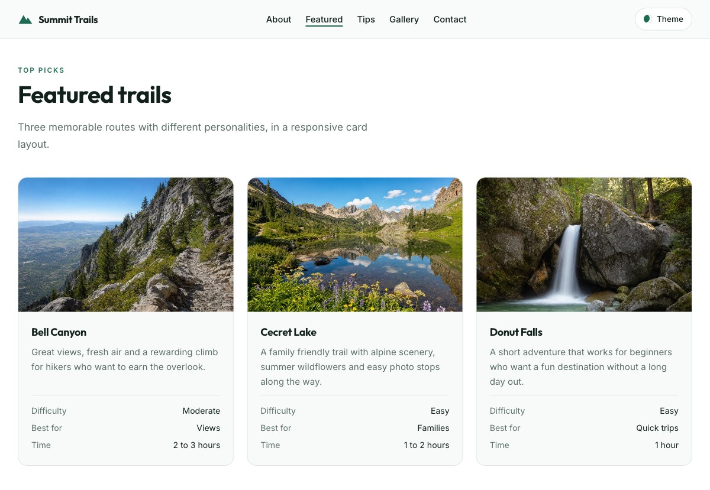

# Summit Trails

A responsive hiking guide for Utah mountain trails, built with semantic HTML, CSS Grid, Flexbox and vanilla JavaScript. No framework and no build step.



**Live site:** https://reynaldonikola.github.io/summit-trails/

## What it does

- Theme toggle in the header that switches light and dark and remembers the choice in `localStorage`
- Falls back to the visitor's system theme when no choice has been stored
- Full-bleed hero with a slow pan on load
- Trail cards with hover lift and image zoom, laid out with CSS Grid `auto-fit`
- Sections that fade in through `IntersectionObserver`, staggered inside each grid
- Nav link that tracks the section currently on screen
- Gallery with captions over a gradient, collapsing from three columns to one
- Every animation turns off under `prefers-reduced-motion`

## Built with

HTML5, CSS custom properties, CSS Grid, Flexbox, `IntersectionObserver`, `localStorage`.

## Structure

```
index.html
css/main.css
js/main.js
images/
```

## Running it

```bash
python3 -m http.server 8000
```

Then open http://localhost:8000.

## Credits

Photography generated for this project. Built by Reynaldo Moros as coursework at Utah Valley University.
